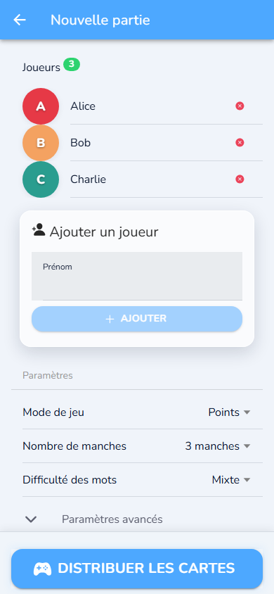
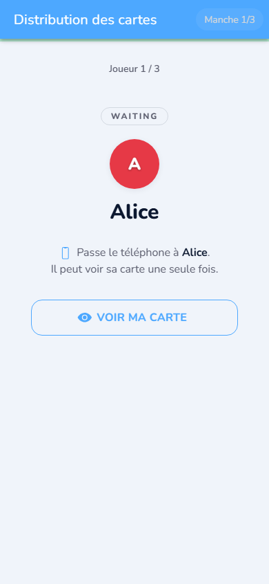
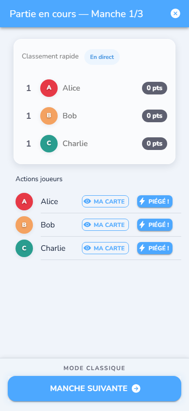
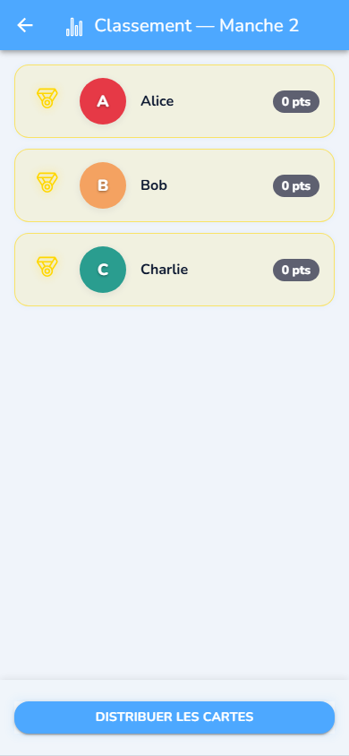
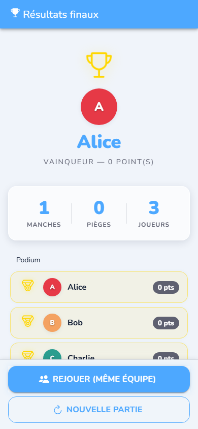
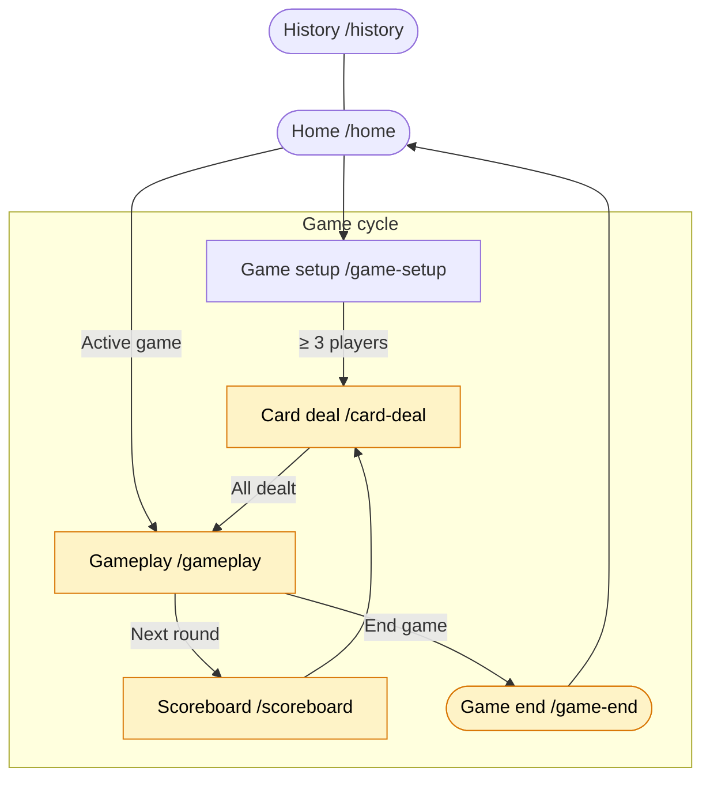

# Slip It

> Documentation en français : [README.md](README.md)

## Screenshots

| Home | Game setup | Card deal |
|------|-----------|----------|
|  |  |  |

| Gameplay | Scoreboard | Final podium |
|---------|-----------|-------------|
|  |  |  |

> Place screenshots in `docs/screenshots/`. See [how to generate them](#generating-screenshots) below.

Slip It is a French-language mobile party game designed to be played in person with a single shared phone. Each player secretly receives a target (another player) and a secret word. The objective is to steer the conversation so the target says the word naturally. When it happens, the trap is confirmed and the trapper scores a point.

The app is built with Ionic 8 + Angular 18, runs as a PWA, can be packaged for Android via Capacitor, and requires no backend. Game state is persisted locally on the device.

## Key features

- Local play, no account, no server.
- 3 to 10 players per game.
- Local game state persistence.
- Secret card distribution with phone hand-off.
- Leaderboard, multiple rounds, end-of-game podium, and local history.
- Static word dictionary managed by a built-in admin tool.

## Tech stack

- Ionic 8
- Angular 18
- Capacitor 6
- RxJS for application state
- Ionic Storage for local persistence
- Jasmine + Karma for unit tests
- Playwright for end-to-end tests

## Screen flow



> Yellow routes are protected by `GameActiveGuard`.

## Game loop

1. The host creates a game and adds players.
2. The app assigns each player a secret mission: a target and a secret word.
3. Players talk freely and try to get their target to say the word.
4. A confirmed trap scores a point; the game advances until the final podium.

## Architecture

```text
src/
  app/
    core/
      guards/
      models/
      services/
      utils/
    features/
      home/
      game-setup/
      card-deal/
      gameplay/
      scoreboard/
      game-end/
      history/
    shared/
  assets/
    words/
      easy.json
      medium.json
      hard.json
scripts/
  word-admin/
e2e/
  fixtures/
  helpers/
  pages/
  tests/
android/
```

## Routes

Lazy-loaded routes:

- `/home`
- `/game-setup`
- `/card-deal`
- `/gameplay`
- `/scoreboard`
- `/game-end`
- `/history`

The game routes (`/card-deal`, `/gameplay`, `/scoreboard`, `/game-end`) are guarded and block access until a game exists beyond the setup phase.

## Requirements

- Recent Node.js compatible with Angular 18
- npm
- Android Studio if you want to build or open the Android project

## Install

```bash
npm install
```

## Run locally

```bash
npm start
```

Open:

```text
http://localhost:4200
```

## Scripts

### Development

```bash
npm start
npm run build
npm run build:prod
npm run watch
```

### Quality and tests

```bash
npm test
npm run e2e
npm run e2e:ui
npm run e2e:headed
npm run e2e:debug
npm run e2e:report
```

### Capacitor / Android

```bash
npm run cap:sync
npm run android
npm run cap:add:android
npm run cap:add:ios
```

### Word dictionary tools

```bash
npm run word-admin
npm run word-admin:build-freq
node scripts/word-admin/reclassify-words.js --dry-run
node scripts/word-admin/reclassify-words.js --write
```

## Tests

### Unit tests

```bash
npm test
```

### End-to-end

Playwright tests start an Angular dev server automatically on port `4200`.

```bash
npm run e2e
```

The HTML report is written to `playwright-report/`.

## Web and Android build

### Production web build

```bash
npm run build:prod
```

Outputs to `www/`, which Capacitor uses as the web layer.

### Sync Capacitor

```bash
npm run cap:sync
```

### Open the Android project

```bash
npm run android
```

Builds the app, syncs Capacitor for Android, then opens the native project in Android Studio.

## Persistence and data

- No remote API is required to play.
- Game data is stored locally via Ionic Storage.
- The word dictionary is bundled in `src/assets/words/`.
- Match history is stored locally on the device.

## Word dictionary administration

The repository includes a local tool for managing the game's word lists.

### Admin interface

```bash
npm run word-admin
```

Then open:

```text
http://localhost:4242
```

This UI lets you load, edit, and save `easy.json`, `medium.json`, and `hard.json`.

### Build the frequency database

```bash
npm run word-admin:build-freq
```

Downloads three French academic lexical datasets (Lexique 3.83, CHACQFAM, Imag_1493) and builds `scripts/word-admin/freq-db.json` containing a composite difficulty score for each word.

### Reclassify words

Preview changes only:

```bash
node scripts/word-admin/reclassify-words.js --dry-run
```

Apply changes:

```bash
node scripts/word-admin/reclassify-words.js --write
```

## Offline support

The app is designed as a PWA. Once loaded, a game can run entirely offline. A service worker and web manifest are included to support installation on a device home screen.

## Contributing

### Code conventions

**Angular and TypeScript**

- NgModule required: no standalone components.
- No Angular signals or new reactivity APIs.
- Application state via `BehaviorSubject` in facade services.
- `ChangeDetectionStrategy.OnPush` on all components.
- Clean up subscriptions in `ngOnDestroy` using `takeUntil` or `Subscription.add`.
- File naming: `kebab-case`, suffixed `.service.ts`, `.component.ts`, `.page.ts`, `.guard.ts`, `.module.ts`, `.model.ts`.

**Services**

- Singleton services are declared with `providedIn: 'root'` or registered in `CoreModule`.
- Service dependencies are injected through the constructor, never accessed directly.
- No business logic in components that belongs in a service.

**Module structure**

- One feature module per route (`home.module.ts`, `gameplay.module.ts`, etc.).
- `CoreModule` imports `IonicStorageModule` and registers shared services.
- `SharedModule` contains only reusable components and pipes shared across features.

**Word dictionary**

- The JSON format for `src/assets/words/*.json` is `[{ word, category, difficulty }]`.
- Do not edit difficulty values manually if `freq-db.json` is present; use `reclassify-words.js` instead.

### E2E conventions (Playwright)

- Each screen has a Page Object in `e2e/pages/`.
- All Page Objects extend `BasePage` (`e2e/pages/base.page.ts`).
- Shared test helpers live in `e2e/helpers/`.
- Custom Playwright fixtures are in `e2e/fixtures/`.
- Name test files `NN-short-description.spec.ts` with a numeric prefix.
- No shared state between tests: each test starts from an empty `localStorage`.

### Adding or editing words

1. Start the admin interface: `npm run word-admin`.
2. Open `http://localhost:4242`.
3. Add or correct words, then save.
4. Optionally recalculate difficulties: `reclassify-words.js --dry-run` then `--write`.

### Adding a new screen

1. Create a feature module in `src/app/features/screen-name/`.
2. Register a lazy route in `app-routing.module.ts`.
3. Add `canActivate: [GameActiveGuard]` if the screen requires an active game.
4. Create a matching Page Object in `e2e/pages/`.
5. Write E2E tests in `e2e/tests/`.

### Generating screenshots

Screenshots belong in `docs/screenshots/` as PNG files, ideally captured on Chrome mobile (375 × 812 px, iPhone 13 viewport).

With Playwright (recommended):

```bash
npm start &
npx playwright screenshot --browser chromium --viewport-size="375,812" \
  http://localhost:4200/home          docs/screenshots/home.png
npx playwright screenshot --browser chromium --viewport-size="375,812" \
  http://localhost:4200/game-setup    docs/screenshots/game-setup.png
```

Or manually from Chrome DevTools (device mode « iPhone 13 »):
1. Navigate to the desired screen.
2. `Ctrl+Shift+P` → « Capture screenshot ».
3. Save to `docs/screenshots/<screen-name>.png`.

Expected files:

```text
docs/screenshots/
  home.png
  game-setup.png
  card-deal.png
  gameplay.png
  scoreboard.png
  game-end.png
```

## Project status

The repository contains:

- The main Ionic/Angular application
- The Android Capacitor project
- 25 Playwright E2E test files
- Word dictionary administration scripts

## License

No license has been declared in this repository.
