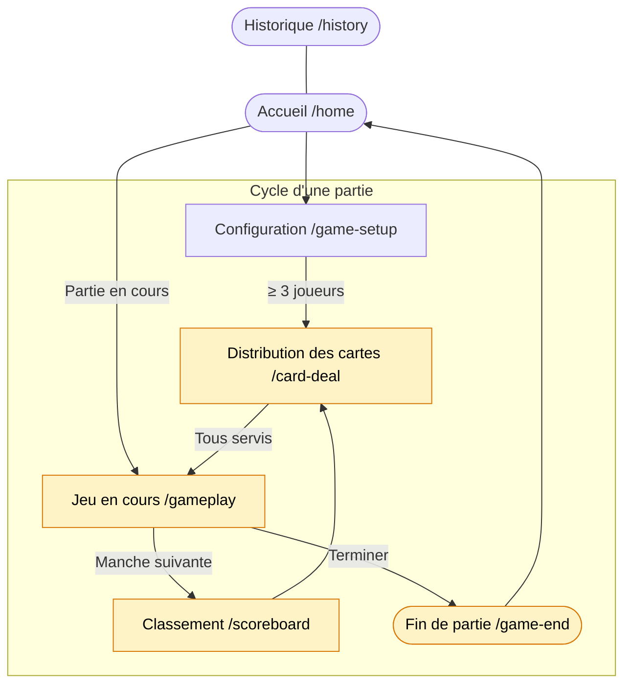

# Slip It

> English documentation: [README-en.md](README-en.md)

Slip It est un jeu de soirée mobile en français, pensé pour être joué en présentiel avec un seul téléphone partagé entre les joueurs. Chaque participant reçoit secrètement une cible et un mot à faire prononcer naturellement pendant la conversation. Quand la cible dit le mot, le piège est validé et le piégeur marque un point.

L'application est construite en Ionic 8 + Angular 18, fonctionne comme une PWA, peut être empaquetée sur Android via Capacitor, et ne dépend d'aucun backend. L'état d'une partie est persisté localement sur l'appareil.

## Points clés

- Jeu local, sans compte et sans serveur.
- Une partie se joue de 3 à 10 joueurs.
- Persistance locale de l'état de partie.
- Distribution secrète des cartes avec passage du téléphone.
- Classement, manches, fin de partie et historique local.
- Dictionnaire de mots statique administrable via un mini-outil interne.

## Captures d'écran

| Accueil | Configuration | Distribution |
|---------|--------------|-------------|
|  |  |  |

| Jeu en cours | Classement | Podium final |
|-------------|-----------|-------------|
|  |  |  |

> Les captures sont à placer dans `docs/screenshots/`. Voir [comment les générer](#générer-les-captures-décran) ci-dessous.

## Stack technique

- Ionic 8
- Angular 18
- Capacitor 6
- RxJS pour l'état applicatif
- Ionic Storage pour la persistance locale
- Jasmine + Karma pour les tests unitaires
- Playwright pour les tests end-to-end

## Flux des écrans



> Les routes en jaune sont protégées par `GameActiveGuard`.

## Boucle de jeu

1. L'hôte crée une partie et ajoute les joueurs.
2. L'application distribue une mission secrète à chaque joueur: une cible et un mot.
3. Les joueurs discutent librement et tentent de faire prononcer leur mot à leur cible.
4. Un piège validé rapporte un point, puis la partie progresse jusqu'au classement final.

## Architecture

```text
src/
  app/
    core/
      guards/
      models/
      services/
      utils/
    features/
      home/
      game-setup/
      card-deal/
      gameplay/
      scoreboard/
      game-end/
      history/
    shared/
  assets/
    words/
      easy.json
      medium.json
      hard.json
scripts/
  word-admin/
e2e/
  fixtures/
  helpers/
  pages/
  tests/
android/
```

## Parcours applicatif

Les principales routes lazy-loadées sont:

- `/home`
- `/game-setup`
- `/card-deal`
- `/gameplay`
- `/scoreboard`
- `/game-end`
- `/history`

Les routes de jeu (`/card-deal`, `/gameplay`, `/scoreboard`, `/game-end`) sont protégées par un garde empêchant l'accès tant qu'aucune partie n'existe au-delà de la phase de configuration.

## Prérequis

- Node.js récent compatible Angular 18
- npm
- Android Studio si vous souhaitez ouvrir ou builder le projet Android

## Installation

```bash
npm install
```

## Lancer le projet en local

```bash
npm start
```

Application disponible sur:

```text
http://localhost:4200
```

## Scripts utiles

### Développement

```bash
npm start
npm run build
npm run build:prod
npm run watch
```

### Qualité et tests

```bash
npm test
npm run e2e
npm run e2e:ui
npm run e2e:headed
npm run e2e:debug
npm run e2e:report
```

### Capacitor / Android

```bash
npm run cap:sync
npm run android
npm run cap:add:android
npm run cap:add:ios
```

### Outils dictionnaire

```bash
npm run word-admin
npm run word-admin:build-freq
node scripts/word-admin/reclassify-words.js --dry-run
node scripts/word-admin/reclassify-words.js --write
```

## Tests

### Unitaires

Les tests unitaires sont exécutés avec Jasmine/Karma:

```bash
npm test
```

### End-to-end

Les tests E2E reposent sur Playwright. La configuration démarre automatiquement un serveur Angular local sur le port `4200`.

```bash
npm run e2e
```

Le rapport HTML Playwright est généré dans `playwright-report/`.

## Build web et Android

### Build production web

```bash
npm run build:prod
```

Le build de production alimente le répertoire `www/`, utilisé ensuite par Capacitor.

### Synchroniser Capacitor

```bash
npm run cap:sync
```

### Ouvrir le projet Android

```bash
npm run android
```

Cette commande build l'application, synchronise Capacitor pour Android, puis ouvre le projet natif.

## Persistance et données

- Aucune API distante n'est requise pour jouer.
- Les données de partie sont stockées localement via Ionic Storage.
- Le dictionnaire est embarqué dans `src/assets/words/`.
- L'historique de parties est conservé localement sur l'appareil.

## Administration du dictionnaire

Le dépôt contient un outil local pour gérer les mots utilisés dans le jeu.

### Interface d'administration

```bash
npm run word-admin
```

Puis ouvrir:

```text
http://localhost:4242
```

Cette interface permet de charger, éditer et sauvegarder les fichiers `easy.json`, `medium.json` et `hard.json`.

### Base de fréquence lexicale

```bash
npm run word-admin:build-freq
```

Ce script construit `scripts/word-admin/freq-db.json` à partir de trois sources lexicales françaises (Lexique 3.83, CHACQFAM, Imag_1493) afin de calculer un score composite de difficulté pour chaque mot.

### Reclassification des mots

Prévisualisation:

```bash
node scripts/word-admin/reclassify-words.js --dry-run
```

Application des changements:

```bash
node scripts/word-admin/reclassify-words.js --write
```

## Fonctionnement hors ligne

L'application est pensée comme une PWA. Une fois chargée, le jeu peut continuer à fonctionner sans backend, avec stockage local de l'état de partie. Le service worker et le manifest web sont présents dans le projet pour supporter ce mode d'usage.

## Contribuer

### Conventions code

**Angular et TypeScript**

- NgModule obligatoire: pas de composants standalone.
- Pas de signals Angular ni de nouvelle API de réactivité.
- State applicatif via `BehaviorSubject` dans les services façade.
- `ChangeDetectionStrategy.OnPush` sur tous les composants.
- Nettoyage des subscriptions dans `ngOnDestroy` via pattern `takeUntil` ou `Subscription.add`.
- Noms de fichiers: `kebab-case`, suffixe `.service.ts`, `.component.ts`, `.page.ts`, `.guard.ts`, `.module.ts`, `.model.ts`.

**Services**

- Les services singletons sont déclarés avec `providedIn: 'root'` ou enregistrés dans `CoreModule`.
- Les dépendances entre services passent par injection de constructeur, jamais par accès direct.
- Aucune logique dans les composants qui devrait vivre dans un service.

**Structure des modules**

- Un module de feature par route (`home.module.ts`, `gameplay.module.ts`, etc.).
- Le `CoreModule` importe `IonicStorageModule` et déclare les services partagés.
- Le `SharedModule` contient uniquement des composants/pipes réutilisables entre features.

**Dictionnaire de mots**

- Le format JSON `src/assets/words/*.json` est `[{ word, category, difficulty }]`.
- Ne pas modifier la difficulté manuellement si `freq-db.json` est présent: utiliser `reclassify-words.js`.

### Conventions E2E (Playwright)

- Chaque écran a un Page Object dans `e2e/pages/`.
- Tout Page Object étend `BasePage` (`e2e/pages/base.page.ts`).
- Les helpers partagés entre tests sont dans `e2e/helpers/`.
- Les fixtures Playwright personnalisées sont dans `e2e/fixtures/`.
- Nommer les fichiers de tests `NN-description-courte.spec.ts` avec un préfixe numérique.
- Ne pas partager d'état entre deux tests (chaque test repart d'un `localStorage` vide).

### Ajouter/modifier des mots

1. Lancer l'interface d'administration: `npm run word-admin`.
2. Ouvrir `http://localhost:4242`.
3. Ajouter ou corriger les mots dans l'interface, puis sauvegarder.
4. Optionnel: re-calculer les difficultés avec `reclassify-words.js --dry-run` puis `--write`.

### Ajouter un écran

1. Créer le module feature dans `src/app/features/nom-ecran/`.
2. Déclarer la route lazy dans `app-routing.module.ts`.
3. Ajouter le `canActivate: [GameActiveGuard]` si l'écran nécessite une partie active.
4. Créer le Page Object correspondant dans `e2e/pages/`.
5. Écrire des tests E2E dans `e2e/tests/`.

### Générer les captures d'écran

Les captures sont attendues dans `docs/screenshots/` au format PNG, idéalement prise sur Chrome mobile (375 × 812 px, viewport iPhone 13).

Avec Playwright (recommandé) :

```bash
npm start &
npx playwright screenshot --browser chromium --viewport-size="375,812" \
  http://localhost:4200/home          docs/screenshots/home.png
npx playwright screenshot --browser chromium --viewport-size="375,812" \
  http://localhost:4200/game-setup    docs/screenshots/game-setup.png
```

Ou manuellement depuis Chrome DevTools (mode device « iPhone 13 ») :
1. Ouvrir l'écran voulu.
2. `Ctrl+Shift+P` → « Capture screenshot ».
3. Enregistrer dans `docs/screenshots/<nom-ecran>.png`.

Fichiers attendus :

```text
docs/screenshots/
  home.png
  game-setup.png
  card-deal.png
  gameplay.png
  scoreboard.png
  game-end.png
```

## État du projet

Le dépôt contient:

- l'application principale Ionic/Angular
- le projet Android Capacitor
- 25 fichiers de tests E2E Playwright
- des scripts d'administration pour le dictionnaire de mots

## Licence

Aucune licence n'est déclarée actuellement dans ce dépôt.